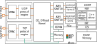

# Introduction to ACCL

The Adaptive Collective Communication Library (or ACCL, pronounced like the Irish island) is a framework of software and hardware components designed to provide MPI-like communication capability. Similar to NCCL and RCCL, ACCL provides a small but highly architecture-optimized subset of MPI collectives. 

With ACCL, applications can move data directly between FPGA local memories, utilizing the 100 Gbps Ethernet ports on Alveo  FPGA accelerator cards, and avoiding copies to host memory or transfers over host NICs. This makes it similar to Nvidia GPUDirect, except with ACCL a single card serves for both networking and compute.

## Why MPI?

The Message Passing Interface ([MPI](http://mpi-forum.org/)), is a standardized and portable message-passing system designed to function on a wide variety of parallel computers. Its wide availability, universal support and high performance make it the lingua franca of distributed computing and a natural API to follow when implementing specialized distributed computation frameworks such as ACCL. 

## Which parts of MPI does ACCL implement?

ACCL implements:
- send and receive
- broadcast
- scatter, gather, and allgather
- reduce and allreduce
- reduce-scatter

## How does ACCL work?

ACCL is a combination  of  software  running  on  the  host  CPU,  FPGA data-moving  hardware,  and  control  firmware  executing  ona  FPGA-embedded  microcontroller. Here is a high  level  overview  of  the  ACCL  structure:

In  the  FPGA, ACCL   features   a   collectives   offload   engine   (``CCLO``)   an done  or  more  network  protocol  offload  engines  (``POE``),  each of  which  is  implemented  as  a  stand-alone  Vitis  kernel.  The ``CCLO``  implements  the  collectives  on  top  of  ``TCP/IP``  or  ``UDP``. The  protocol  offload  engines  implements  the  full  network stack  up  to  ``UDP``  and  ``TCP/IP``  respectively  and  connect  directly to  Ethernet  ports,  e.g.  through  Alveo  Gigabit  Transceivers and  ``QSFP28``  ports. The  host  communicates  with  the  CCLO  over  ``PCIe`` and  ``Xilinx  XDMA``,  but  this  complexity  is  hidden  by  XRT and  our  drivers.  The  distributed  application  that  runs  on,possibly  multiple,  hosts  leverages  the  ACCL  [Python](../driver/pynq/cclo.py)  or  [C++](../driver/xrt/src/) driver  to  control  the  CCLO.  
More info on CCLO [here](#How-it-is-implemented) 

## Next Sections

[Overview of ACCL and its API](./api.md)

[ACCL Hardware Deep Dive](./kernel.md)

[Overview of Offloaded Collectives](./collectives.md)

[Building ACCL](./build.md)

[Debugging ACCL](./debug.md)